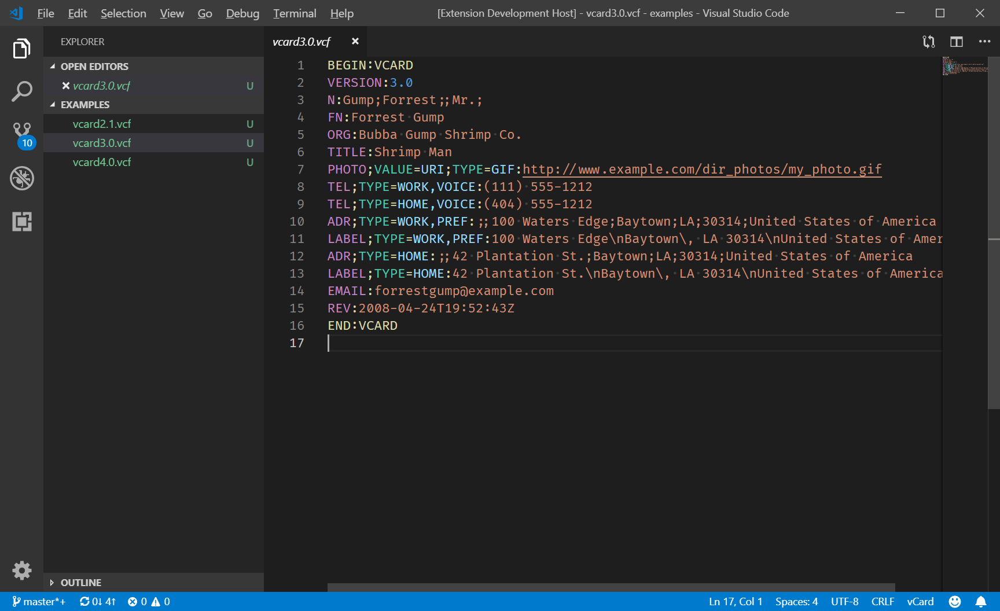

# vCard

This extension currently provides syntax highlighting for vCard files (.vcf, vcard). vCard files are used to exchange contact information as electronic business cards. More information about this file format can be found on [this wikipedia page](https://en.wikipedia.org/wiki/VCard).

Future changes to this extension will include auto-complete, error checking (squiggles), quick view (on hover), and a preview window to make viewing and editing vCard files easier.

***

## Features

### Syntax Highlighting:

## Known Issues

There are no known issues at this time. This section will be updated as and when issues are discovered.

## Release Notes

### [1.0.0] - 2019-04-18

#### Added

* Syntax Highlighting

***

## Contributing

If you have any feedback, please open an issue at the project's [github issues page](https://github.com/cstrachan88/vscode-vcard/issues).

Feedback is encourged, and pull requests are welcome!

## License

This project is licensed under the [MIT License](LICENSE.txt).
